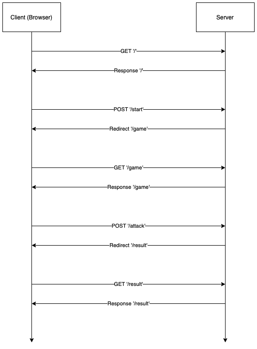

# RPS Challenge

## Request/Response Diagram


## Instructions

$ git clone https://github.com/Marlon-Buckley/rps-challenge-apprenticeships
$ cd rps-challenge
$ bundle
$ rackup


## Set up

```bash
$ bundle install
$ rspec
# You should output that includes:
# 1 example, 0 failures
```
