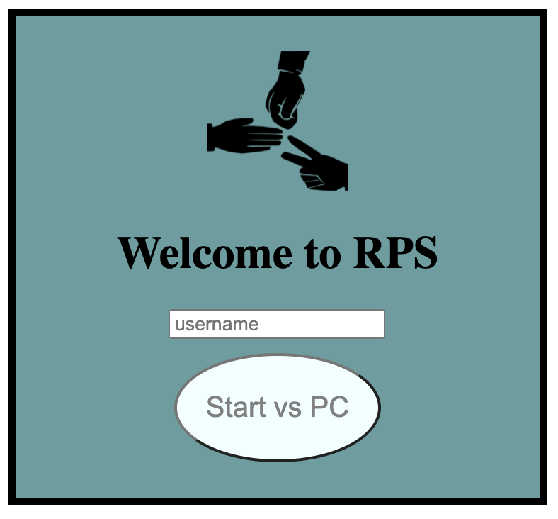
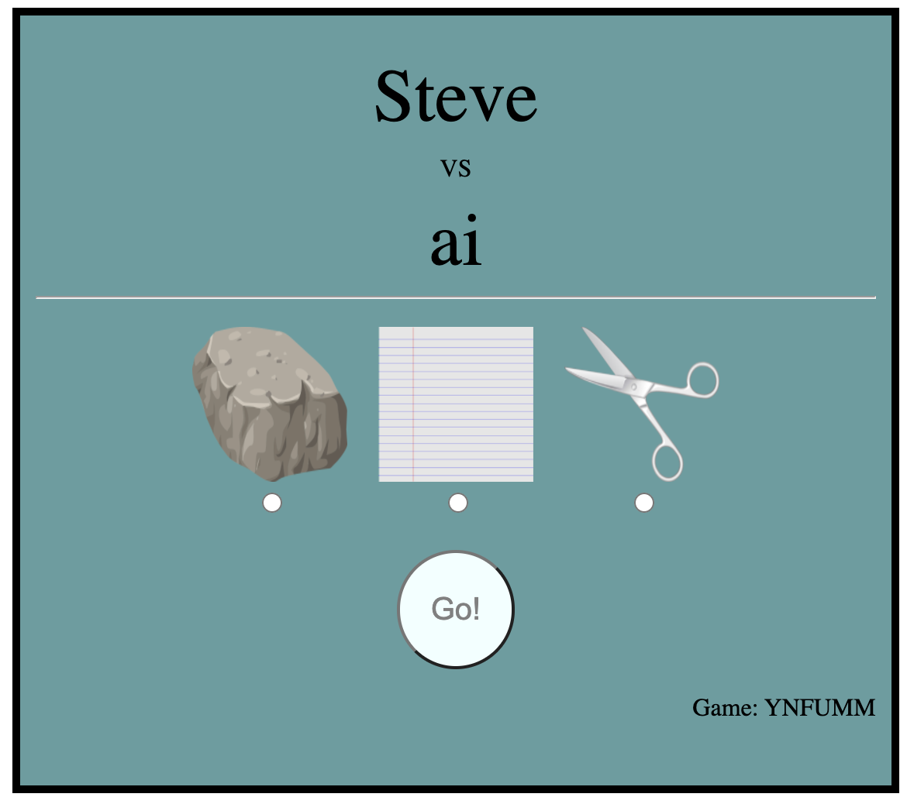
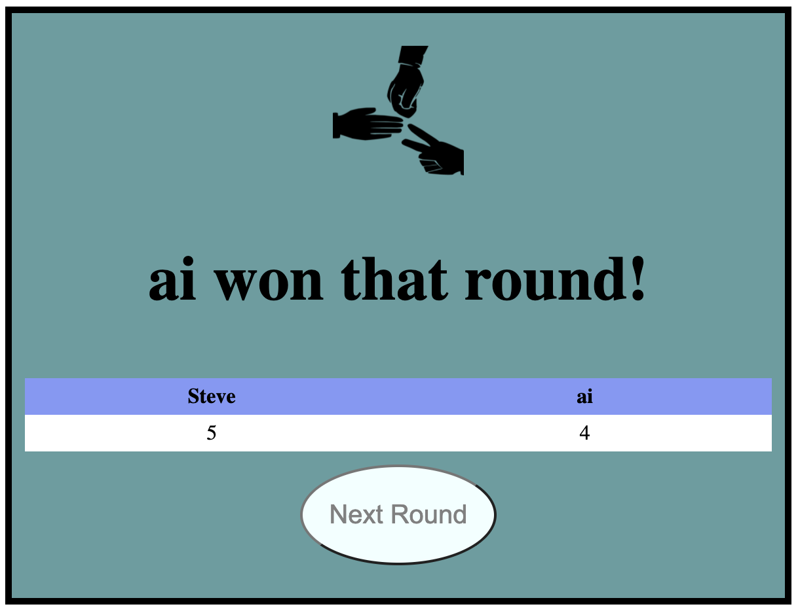

# Rock, Paper, Scissors

Welcoome to RPS a real-time strategy game - completely original and not a thing like anything else that has ever existed!

This is a browser-based rock, paper, scissors game. The player can enter thier name to start up a competition against the server. Originally I planned the game to work with a multiplayer aspect against another human, but the amount of work needed to get that up and running for a friday challenge was too much, so changed focus and just kept it as a single player game.

There are three main screens:

## Home Page

This is the page the user can sign-up on and start the game.

## Game Screen

This is the page where the user sees who they are up against and can select thier move for the next round.

## Result Page

This is the page the user sees the results of the game, and can choose to play another round.

# Install

To install the app, clone the repo, then run `bundle install` this will install all required dependencies. To start the application, run `rackup` and optionally set the port by adding the `-p` flag. Then navigate to your web browser and go to localhost at the default port of `9292` or the port you set manually.

# Logic

Most of my game logic lives in `GameService` and `RockPaperScissorsDecider`. The GameService is a dependency injected into the controller to ensure there is only one of them each time the server runs. The RockPaperScissorsDecider is simply a static class with a single method that take the two moves as arguments and calulates which player won based on the default rock, paper, scissors moves.

# Thoughts, problems and challenges

This app does not do everything I wanted it to do, when starting out I focused on the multiplayer aspects. However after getting the basic web server http services up and running the main challenge I came up against was figuring out the flow of data between the client and the server and ensuring both sides were given everything they need. This took much longer than expected to do correctly with a full test suite f unit and feature tests.

One of the main challenges I came up against was if multiple games were running at once. This would override the session data managed by Sinatra. To overcome this, I used hidden form fields on the client side to store a game_id and the current user. This meant the client would help me keep at track of the users session behind the scenes. Each time a POST request was made, the parameters contained all the information I need to target the correct game session and run logic against it - and then be passed as session data to the redirect.

# Next Steps

If I were to carry on adding to this app there are a few next steps I have in mind. First of all I would add a few convinences to the client-side such as an exit button to leave the current game. Second would be to implemnet the multiplayer aspect of the game. A lot of my code was written with that in mind so it is a lot more complex that it needed to be for a single player game with just the basic game mode, but because of this, it would make it easier to add the multiplayer aspects to it at a later date.
