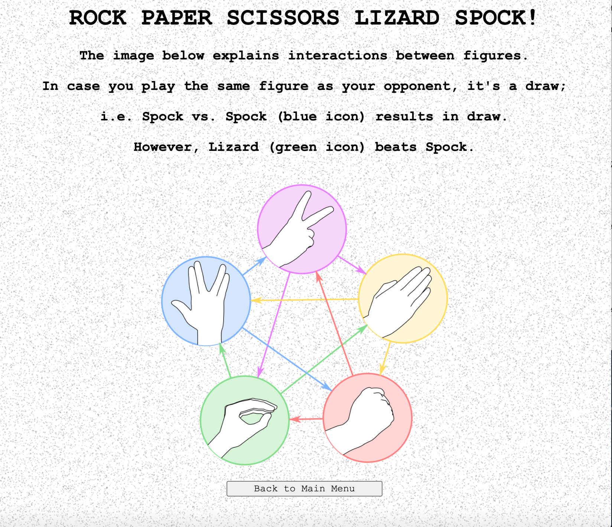

# RPSLS Challenge





## Task

Knowing how to build web applications is getting us almost there as web developers!

The Makers Academy Marketing Array ( **MAMA** ) have asked us to provide a game for them. Their daily grind is pretty tough and they need time to steam a little.

Your task is to provide a _Rock, Paper, Scissors_ game for them so they can play on the web with the following user stories:

```
As a marketeer
So that I can see my name in lights
I would like to register my name before playing an online game

As a marketeer
So that I can enjoy myself away from the daily grind
I would like to be able to play rock/paper/scissors
```

Hints on functionality

- the marketeer should be able to enter their name before the game
- the marketeer will be presented the choices (rock, paper and scissors)
- the marketeer can choose one option
- the game will choose a random option
- a winner will be declared


## Outcomes

- Testing and coverage:
Task has been completed in a TDD manner, feature testing with Capybara and unit testing with RSpec was involved. 
The coverage of 100% was achieved. 
Additionally, `rubocop` accepts the code as clean. 

- Reflection on blockers:
The biggest blocker I have encountered while working on the project, was getting to know enough of `CSS` to be able to speed up my `HTML` editing. 
It took me some time to understand and execute proper external styling with `CSS`. 

- Code quality:
Classes for the game: `Game` and `Player` were tested in isolation with the usage of appropriate stubbing and doubling. 
App controllers were ketp "skinny" and all the logic was kept in classes. 
`HTML` views werre not involved in logic as advised.

- Extension:
As an extension, app lets user either play with computer or against another user locally (in the same browser window). Aditionally, the app has been successfully deplyed via [Heroku](https://www.heroku.com/).


## The app 

The deployed app can be found here: [https://rps1s.herokuapp.com/](https://rps1s.herokuapp.com/).


