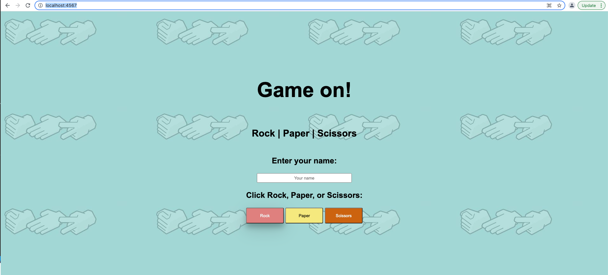
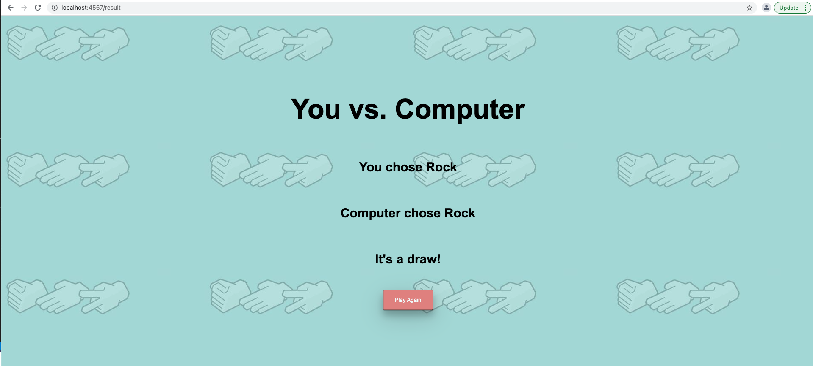

# RPS Challenge

Task
-----
The task for this challenge was to create a Rock, Paper, Scissors web application that utilised Object Oriented Programming (OOP) through a Test Driven Development (TDD) approach. In addition, the application was to be tested using Capybara and Sinatra. The user stories below outline the requirements for this challenge - to be able to register a username and play a game of rock, paper, scissors.

My approach to this challenge was to work through each individual user story, breaking each component down into the simplest requirement to create each class and method as needed, while applying the **RED, GREEN, REFACTOR** method in parallel. This method requires a test to be created initially to define what each element of the application should be doing, running the test to ensure they are failing in the intended way, then developing the feature using the test requirements. Once the feature is working correctly and the tests are passing, I then revisited my code to improve implementation, readability for better maintainability, and overall scalability. For this challenge, I particularly enjoyed integrating Capybara and the Selenium WebDriver into RSpec to automatically test my application's user interface.

User Stories
-----
```
As a marketeer
So that I can see my name in lights
I would like to register my name before playing an online game

As a marketeer
So that I can enjoy myself away from the daily grind
I would like to be able to play rock/paper/scissors
```
Installation
-----
* Fork this repo
* Run the command 'bundle' in the project directory to ensure you have all the gems

How To Run Tests
-----
Once `bundle` has been ran, to test the application,

1. Open the application directory `/rps-challenge-apprenticeships` using your preferred terminal.
2. Run `rspec` to see a list of tests and coverage reports.

In your terminal, you should see the below: 

```
Homepage
  visit Homepage and display correct content
  should enter name and make choice

Results page
  should display results page with details
  should show player name as "You" if no name is entered

ComputerOpponent
  #computer_choice
    should pick Rock, Paper or Scissors

Game
  #winner
    should return a draw -  Rock vs Rock
    should return Player wins - Rock vs Scissors
    should return Player wins - Paper vs Rock
    should return Computer wins - Rock vs Paper
    should return Computer wins - Paper vs Scissors

Player
  #initialize
    should set the player name to what is passed in
    should set the player name to "You" when no name is passed
    should set the player choice to what is passed in

Have you considered running rubocop? It will help you improve your code!
Try it now! Just run: rubocop

Finished in 20.26 seconds (files took 0.36409 seconds to load)
13 examples, 0 failures


COVERAGE: 100.00% -- 107/107 lines in 9 files
```

**In addition, chrome will open and run through the feature tests.**

To disable chrome opening to run the tests: 

1. Navigate to the spec_helper.rb file found here -> `spec/spec_helper.rb`.
2. Comment out lines 22 & 23 (Capybara.server = :webrick Capybara.default_driver = :selenium_chrome).
3. Rerun `rspec` in your terminal.

To change the speed Capybara and Selenium run the automated browser tests:

1. Navigate to the homepage_spec.rb file found here -> `spec/features/homepage_spec.rb`.
2. Change the value for `sleep_time_for_capybara = 1` on line 2. This is currently set to wait 1 second after each step in the browser. Set this to a higher value for slower runtime in the browser, or set it to a lower number for faster runtime in the browser.
3. Navigate to the results_page_spec.rb file found here -> `spec/features/results_page_spec.rb`.
4. Repeat step 2 in the results_page_spec.rb file.
5. Rerun `rspec` in your terminal.

How To Use The Application
-----

1. Open the application directory `/rps-challenge-apprenticeships` using your preferred terminal.
2. Run `rackup -p 4567`.

You should see something that resembles the below in your terminal: 

```
[2021-10-08 17:04:18] INFO  WEBrick 1.7.0
[2021-10-08 17:04:18] INFO  ruby 3.0.2 (2021-07-07) [arm64-darwin20]
[2021-10-08 17:04:18] INFO  WEBrick::HTTPServer#start: pid=89359 port=4567
```

3. In your browser, navigate to `http://localhost:4567/`

In your browser you should see this homepage: 



4. On the homepage, enter your name and select Rock, Paper or Scissors by clicking the button. 

In your browser you should see the results page:



5. To play again, click the `Play Again` button

Built Using
-----

* Ruby
* Sinatra
* Capybara
* RSpec
* Simplecov
* Rubocop