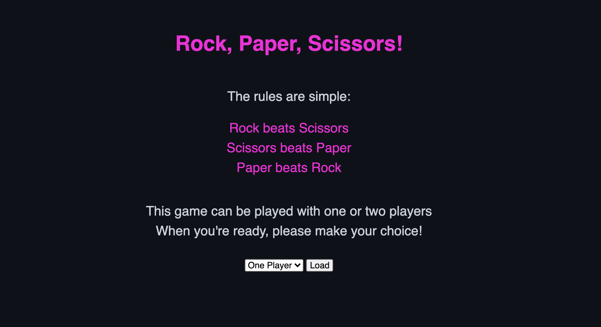

# RPS Challenge

## Set Up
Developed using `Ruby 3.0.2`
- Install dependencies:
  * Capybara
  * RSpec
  * Sinatra
  * Webrick
- Write a feature test
- Get the feature test to pass as simply as possible

## Task

The Makers Academy Marketing Array ( **MAMA** ) have asked us to provide a game for them. Their daily grind is pretty tough and they need time to steam a little.

Your task is to provide a _Rock, Paper, Scissors_ game for them so they can play on the web with the following user stories:

```
As a marketeer
So that I can see my name in lights
I would like to register my name before playing an online game

As a marketeer
So that I can enjoy myself away from the daily grind
I would like to be able to play rock/paper/scissors
```

## Basic Rules

- Rock beats Scissors
- Scissors beats Paper
- Paper beats Rock

## Bonus level 1: Multiplayer (NOT COMPLETE)

Change the game so that two marketeers can play against each other ( _yes there are two of them_ ).

## One-Player Mode Diagram 
The below is a screenshot of the diagram I developed using **Miro** which depicts how I planned for my browser to interact with the server. This is specifically for the initial part of the challenge which was to design a player vs computer mode of Rock, Paper, Scissors.


## Output
Below is the visual of some of the different pages...

### Home Screen


### One-Player Mode


### Multiplayer Mode


### Result Screen
